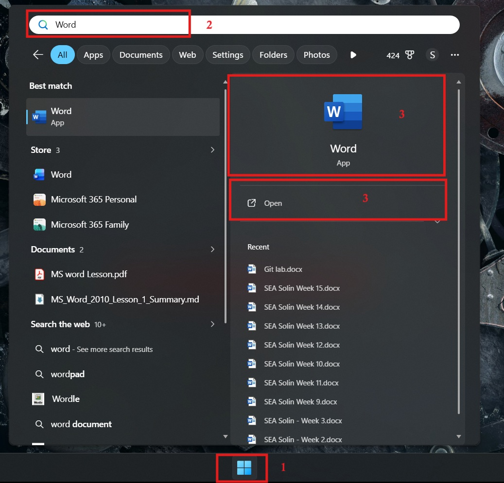

# មេរៀនទី ១៖ គ្រឹះស្ថាន (Fundamentals) នៃកម្មវិធី Microsoft Word 
---

## មាតិកា

### ១. សេចក្តីផ្តើមអំពី Microsoft Word 
### ២. វិធីសាស្ត្រចូលទៅកាន់កម្មវិធី 
### ៣. ការស្វែងយល់ពីផ្ទាំងការងារ (Understand Work Screen)
### ៤. បញ្ជី Mouse Pointer ដែលប្រើប្រាស់ញឹកញាប់
### ៥. ការបង្កើត និងការបិទឯកសារ (Creating & Closing a Document)
### ៦. ការវាយបញ្ចូល និងលុបអត្ថបទ (Entering, Inserting & Deleting Text)
### ៧. ការជ្រើសរើស និងការជំនួសអត្ថបទ (Select & Replace)
### ៨. ការរក្សាទុក និងការបើកឯកសារ (Saving & Opening a Document)
### ៩. ការបោះពុម្ព និងការចាកចេញ (Printing & Exit Word)
---

### ១. សេចក្តីផ្តើមអំពី Microsoft Word 
* **និយមន័យ៖** ជាកម្មវិធីសម្រួលកិច្ចការអត្ថបទ (Word Processing) ដែលអនុញ្ញាតឱ្យបង្កើតឯកសារប្រើប្រាស់ផ្ទាល់ខ្លួន និងសម្រាប់មុខជំនួញជាច្រើនប្រភេទ រួមមាន៖ សំបុត្រ (letters), អត្ថបទ (papers), flyers, កំណត់ត្រាសម្រាប់ប្រើនាពេលអនាគត (memos), ធ្វើរបាយការណ៍ (reports), និងសំបុត្រសារព័ត៌មាន (newsletters)។
* **លក្ខណៈពិសេស៖** ផ្តល់នូវឧបករណ៍សម្រាប់បង្កើតទំព័របណ្តាញ (Web pages) និងរក្សាទុកព័ត៌មានទៅលើ Web Server។ មានលក្ខណៈពិសេសជាច្រើនដើម្បីបង្កភាពងាយស្រួលដល់ការផលិតឯកសារឱ្យមានសោភ័ណភាពកាន់តែប្រសើរ ដូចជាការផ្លាស់ប្តូរទម្រង់ ទំហំ ពណ៌អក្សរ និងការបញ្ចូលស៊ុម ប្រអប់ តារាង រូបភាព ក្រាប និង Web address។

### ២. វិធីសាស្ត្រចូលទៅកាន់កម្មវិធី
1. ចុចប៊ូតុង ``mouse`` ឆ្វេង លើប៊ូតុង **``Start``** ដែលស្ថិតនៅផ្នែកខាងក្រោមចំហៀងខាងឆ្វេងនៃ screen ឬ desktop។
2. ចុចប៊ូតុង ``mouse`` ឆ្វេងលើ **``All Programs``**។
3. រំកិល mouse scroll រកឱ្យឃើញ **Microsoft Office** រួចចុច mouse ឆ្វេងលើវា និងបន្តចុចលើ **Microsoft Office Word**។  
    

### ៣. ការស្វែងយល់ពីផ្ទាំងការងារ (Understand Work Screen)
* **``Quick Access Toolbar៖``** ស្ថិតនៅទីតាំងខ្ពស់ជាងគេនៃ Ribbon អនុញ្ញាតឱ្យប្រើប្រាស់ Commands (វត្ថុបញ្ជា) ទោះបីជាកំពុងស្ថិតនៅលើ tabs មួយណាក៏ដោយ ( commands ទូទៅមាន Save, Undo, និង Repeat)។
* **``Title bar៖``** ប្រើសម្រាប់បង្ហាញឈ្មោះឯកសារ ប្រភេទ និងកម្មវិធី ស្ថិតនៅផ្នែកខាងលើគេបង្អស់នៃ Word Windows (ឈ្មោះលំនាំដើមគឺ *Document1*)។
* **``Control box៖``** ផ្ទុកនូវប៊ូតុងចំនួន ៣ សម្រាប់បង្រួមបង្អួចឱ្យតូចបំផុត (Minimize), ពង្រីកធំប៉ុនទំហំ Screen (Maximize ឬ Restore down), និងបិទកម្មវិធី (Close)។
* **``File Menu៖``** អនុញ្ញាតឱ្យចូលទៅកាន់ Backstage view។
* **``Ribbon taps៖``** ផ្ទុកនូវវត្ថុបញ្ជាតាមលំដាប់លំដោយ និងផ្ទុក tabs ជាច្រើន (Default tabs មានចំនួន ៧ គឺ Home, Insert, Page Layout, References, Mailings, Review និង View)។
* **``Gallery៖``** បណ្តុំវិចិត្រសាលដែលបានកំណត់នូវរចនាបទរបស់ Font, ឈ្មោះ ទំហំ ពណ៌តាមរចនាសម្ព័ន្ធនៃអត្ថបទ។
* **``Group៖``** ផ្ទុកនូវវត្ថុបញ្ជាជាច្រើនតាមលក្ខណៈរបស់វត្ថុបញ្ជានីមួយៗ។
* **``Dialog-box launcher៖``** ប្រើសម្រាប់បើកផ្ទាំង Dialog-box ដែលមានមុខងារបន្ថែមជម្រើសនៃវត្ថុបញ្ជាទៅឱ្យ group នោះ (ឈ្មោះហៅតាមឈ្មោះរបស់ group ឧទាហរណ៍៖ Font Dialog-box)។
* **``Ruler៖``** ស្ថិតនៅផ្នែកខាងលើ និងផ្នែកខាងឆ្វេងនៃឯកសារ ជួយឱ្យការរៀបចំកែសម្រួលឯកសារមានភាពលម្អៀងតិចតួចបំផុត។
* **``Document Windows៖``** ចែកចេញជា ៣ ស្រទាប់ធំៗ៖
  * *Margin (edge)៖* គែមទំនេរជុំវិញខាងក្រៅ (Margin Left, Margin Right, Margin Top, Margin bottom)។
  * *Text boundary៖* ខ្សែបន្ទាត់កំណត់ដែនឱ្យ Work Area។
  * *Work Area៖* ស្រទាប់ខាងក្នុងគេបង្អស់សម្រាប់បញ្ចូល ឬកែប្រែអត្ថបទ រូបភាព តារាង ក្រាប។
* **``Scroll bar៖``** មានទាំងបញ្ឈរ និងផ្តេក សម្រាប់រំកិលមើលផ្នែកផ្សេងៗនៃឯកសារ។
* **``Status bar៖``** របាស្ថិតនៅក្រោមគេបង្អស់ បង្ហាញការងារកំពុងធ្វើ ដូចជា ចំនួនពាក្យ ចំនួនទំព័រ និងលេខទំព័របច្ចុប្បន្ន។
* **``View button៖``** បង្ហាញ Layout View ទាំង ៥ របស់ Word 2010 (Print Layout, Full Reading Layout, Web Layout, Outline Layout, Draft Layout)។
* **``Zoom Controller៖``** ប្រើដើម្បីពង្រីក (ធំបំផុត 500%) ឬបង្រួម (តូចបំផុត 10%) ផ្ទៃនៃឯកសារ។

### ៤. បញ្ជី **Mouse Pointer** ដែលប្រើប្រាស់ញឹកញាប់
* **I-beam pointer៖** ផ្លាស់ប្តូរ Insertion point ឬ select text។
* **Click និង Type pointer (មាន alignment)៖** ផ្លាស់ប្តូរ Insertion point ទៅកាន់ទីតាំងទំនេរដោយ double-clicking រួច paragraph formatting នឹងត្រូវបានបញ្ចូល។
* **Selection pointer៖** ចុចលើប៊ូតុង ឬវត្ថុបញ្ជាផ្សេងៗ។
* **Right-pointing arrow pointer៖** Select យកមួយបន្ទាត់ ឬច្រើនបន្ទាត់ (លេចឡើងពេលចង្អុលទៅ Margin ខាងឆ្វេង)។
* **Hand pointer៖** ប្រើចុចលើ hyperlink ដើម្បីភ្ជាប់ទៅកាន់ឯកសារ ឯកសារយោង ឬវត្ថុផ្សេងទៀត។
* **Hide/Show white space pointer៖** លាក់ ឬបង្ហាញវិញនូវចន្លោះទំនេរក្នុង margin ផ្នែកខាងលើ និងខាងក្រោមនៃឯកសារ។

### ៥. ការបង្កើត និងការបិទឯកសារ (Creating & Closing a Document)
* **Creating a New Document៖** ចូលទៅកាន់ Backstage View តាម File Menu -> ចុចលើប៊ូតុង New -> ជ្រើសរើស Blank document ឬ Template -> ចុចលើ Create។
* **Closing a Document៖** ចុចលើ File -> ចុចលើ Close ក្នុង Backstage View។ ប្រសិនបើមិនទាន់បាន Save នោះផ្ទាំង Information Dialog Box នឹងសួរបញ្ជាក់ថា *"Do you want to save changes you made to Document1?"*
  * *Save៖* អនុវត្តការ Save រួចទើបបិទ។
  * *Don't Save៖* បិទភ្លាមៗ ហើយកិច្ចការដែលពុំទាន់បាន Save នឹងត្រូវបាត់បង់។
  * *Cancel៖* មិនបិទឯកសារនោះទេ។

### ៦. ការវាយបញ្ចូល និងលុបអត្ថបទ (Entering, Inserting & Deleting Text)
* **Entering Text៖** ពេលវាយ អក្សរនឹងលេចចេញពីខាងឆ្វេង Cursor រួចរុញ Cursor ទៅតាម alignment។
* **Caps Lock៖** ចុចដើម្បីវាយអក្សរ UPPER CASE (អក្សរពុម្ពធំ) ទាំងអស់ និងចុចម្តងទៀតដើម្បីដោះចេញ។
* **Shift៖** ចុចរួមគ្នាជាមួយ Key ណាមួយដើម្បីចេញអក្សរពុម្ពធំ ឬនិមិត្តសញ្ញាខាងលើ (ពេលលែងម្រាមដៃនឹងត្រឡប់មកធម្មតាវិញ)។
* **Space Bar៖** ប្រើដើម្បីដកឃ្លា។
* **Enter៖** ប្រើសម្រាប់ចុះបន្ទាត់។
* **Tab៖** ប្រើដើម្បីចូលបន្ទាត់។
* **Num Lock៖** ប្រើបើកភ្លើង Num Lock ដើម្បីប្រើប្រាស់ Numeric Key (ក្តារចុចលេខ)។
* **Inserting Text៖** Insert តួអក្សរត្រង់ទីតាំង Cursor។ ប្រសិនបើចង់ Insert ដោយលុបតួអក្សរខាងស្តាំជាប់ Cursor ត្រូវចុចលើ *Insert Key*។
* **Deleting Text៖**
  * *Backspace៖* លុបតួអក្សរពីស្តាំទៅឆ្វេង (ខាងឆ្វេង Cursor)។
  * *Delete៖* លុបតួអក្សរពីឆ្វេងទៅស្តាំ (ខាងស្តាំ Cursor)។

### ៧. ការជ្រើសរើស និងការជំនួសអត្ថបទ (Select & Replace)
* **Select Text៖** សង្កត់ Mouse ខាងឆ្វេងឱ្យជាប់រួចអូសពីទីតាំងចំណុចមួយទៅចំណុចមួយ។ 
  * បើចង់បានមួយជួរ៖ យក Pointer ទៅចង្អុលចំ Margin ខាងឆ្វេងពីមុខជួរនោះរួច Click។
  * បើចង់បានច្រើនជួរជាប់គ្នា៖ អូស Mouse មិនលែង។ បើមិនរៀងគ្នា៖ Select ដោយចុច Key **Ctrl** ឱ្យជាប់។
* **Replace (Mouse)៖** សង្កត់ Mouse ខាងឆ្វេងឱ្យជាប់ត្រង់កន្លែងដែលបាន Select ម្តងទៀត រួចទាញ (Drag) ទៅកាន់ទីតាំងថ្មី។

### ៨. ការរក្សាទុក និងការបើកឯកសារ (Saving & Opening a Document)
* **Saving a Document៖** ចូល File Menu -> ចុចលើប៊ូតុង Save -> ជ្រើសរើសទីតាំង (Location) -> ដាក់ឈ្មោះ File (File Name) -> ជ្រើសរើសប្រភេទក្នុង Save as Type -> ចុចលើ Save។
* **Opening a Document៖** ចូល File Menu -> ចុចលើប៊ូតុង Open -> ជ្រើសរើស file ពីទីតាំងដែលបាន Save -> ចុចលើ Open។

### ៩. ការបោះពុម្ព និងការចាកចេញ (Printing & Exit Word)
* **Printing a Document៖** ចុច File Menu -> ចុច Print -> កំណត់ចំនួនច្បាប់ (Copies), ជ្រើសរើសម៉ាស៊ីនព្រីន (Printer), និងកំណត់ Printing Layout រួចចុច **Print**។
  * *Hard copy៖* បោះពុម្ពចេញតាមម៉ាស៊ីនព្រីនលើក្រដាស។
  * *Soft copy៖* បោះពុម្ពជាឯកសារឌីជីថល (មើលតាម Output Device)។
* **Exit Word (ការបិទកម្មវិធី)៖** មាន ៣ វិធីសាស្ត្រ៖
  1. ចុចលើប៊ូតុង Close (X) នៅលើ Control Box។
  2. ចុចលើ File -> ចុចលើ Exit។
  3. ចុច Key ផ្សំ **Alt + F4**។ 
